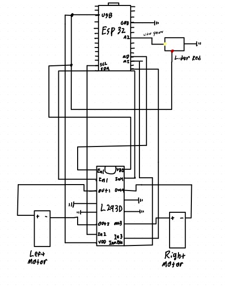

# PIRA - Personal Indoor Robot Assistant

**Date:** December 10, 2024

## Overview
This project centers on building a personal indoor robot assistant capable of autonomous navigation and real-time obstacle avoidance in an indoor environment. The system supports both fully autonomous waypoint traversal, guided by an indoor positioning system (Optitrack), and manual driving via WASD inputs. A Node.js server coordinates data exchange among multiple robots on the same Wi-Fi network, while a Streamlit interface provides a live 2D visualization of each robot’s position and waypoints. TingoDB stores positional data for real-time monitoring and historical analysis.

---

## Key Features

- **Autonomous Navigation**  
  - Uses feedback control (PID) to follow predefined waypoints within a ±10cm margin.  
  - Leverages Optitrack for accurate (x, z, θ) positioning updates.

- **Obstacle Avoidance**  
  - Sharp-IR sensors detect nearby obstacles.  
  - Priority-based control ensures the robot diverts from its path to avoid collisions.

- **Multimodal Control**  
  - **Automatic Mode:** Robot autonomously moves between waypoints, using PID corrections and sensor feedback.  
  - **Manual (WASD) Mode:** Users can override autonomy and steer the robot via keyboard inputs sent through the Node.js server.

- **Real-time Monitoring & Visualization**  
  - Live 2D graphics in a Streamlit dashboard show robot positions, waypoints, and obstacle triggers.  
  - TingoDB logs each position update, enabling real-time data tracking and simple analytics.

- **Scalable Networking**  
  - Node.js server handles multiple robots simultaneously.  
  - Each robot maintains continuous Wi-Fi connectivity and exchanges UDP messages for minimal overhead.

---

## System Requirements and Architecture

### Hardware Integration
1. **ESP32 Microcontroller**  
   - Central controller for motor actuation, sensor readings, and Wi-Fi communication.  
   - Configured with FreeRTOS tasks to manage concurrency.

2. **Sharp-IR Sensor**  
   - Analog distance sensor (ADC-based) providing obstacle detection.  
   - Calibrated to detect objects within a configurable distance threshold.

3. **Optitrack System**  
   - Provides precise localization of the robot in indoor environments.  
   - Streamed position/heading data is used for navigation and control.

4. **Motors & Driver**  
   - Controlled via PWM (LEDC on the ESP32) for linear and rotational motion.  
   - Ensures fine-tuned speed adjustments, crucial for PID feedback loops.

5. **Wi-Fi Networking**  
   - All robots connect to the same local network.  
   - UDP sockets facilitate efficient real-time messaging between robots and the server.

---

## Solution Design

### Core Application Initialization (app_main)
- **Wi-Fi Setup:**  
  Configures SSID, password, and reconnect parameters. Ensures each robot remains online to receive commands and transmit location updates.

- **Motor Control Configuration:**  
  Initializes PWM channels (LEDC) for forward, backward, turning, and stopping states.

- **Sharp IR Sensor & ADC:**  
  Sets up an ADC channel to read distance values. Calibrates the voltage-to-distance curve for obstacle detection.

- **Timers and Tasks Setup:**  
  Creates periodic timers for tasks like checking sensor readings, computing PID corrections, and sending position requests.

### Key FreeRTOS Tasks

1. **Network Listener Task**  
   - Listens for UDP messages (e.g., WASD commands, mode toggles, new waypoint definitions).  
   - Parses incoming data and updates the robot’s operating state (manual vs. autonomous).  
   - In autonomous mode, processes next waypoint instructions and speed/direction updates.

2. **Request Location Task (request_location)**  
   - Periodically sends requests to the Node.js server to obtain the robot’s latest position from Optitrack.  
   - Updates internal state with (x, z, θ) data for use in PID navigation.  
   - In autonomous mode, computes the heading/distance to the target waypoint.

3. **Motor Control Task**  
   - Implements a finite state machine (FSM) for movement: `STATE_MOVE_FORWARD`, `STATE_GO_LEFT`, `STATE_GO_RIGHT`, `STATE_STOP`, etc.  
   - Adjusts PWM duty cycle based on commands from manual input or PID output.  
   - Manages turning maneuvers and speed scaling for smooth directional changes.

4. **Obstacle Detection Task**  
   - Continuously reads Sharp-IR sensor values.  
   - Triggers immediate avoidance behavior if an obstacle is within the critical threshold.  
   - Temporarily overrides PID path corrections, prioritizing collision prevention.

5. **Autonomous Navigation & PID**  
   - Uses proportional, integral, and derivative terms to stabilize heading toward each waypoint.  
   - Computes heading error (difference between current angle and target angle).  
   - Dynamically adjusts motor outputs to minimize error while respecting obstacle avoidance triggers.

---

## Network Communication

### Node.js Server
- **Command Dispatch:**  
  Receives manual drive commands (WASD) or mode-change signals from a user interface.  
  Broadcasts these instructions to the specified robot via UDP.

- **Location Management & TingoDB:**  
  Aggregates position reports from each robot.  
  Stores each robot’s (x, z, θ) data in TingoDB for real-time updates and historical lookback.

- **Streamlit Dashboard:**  
  Polls the database, displaying a 2D map of robots, waypoints, and obstacles.  
  Allows users to observe multiple robots’ positions and statuses simultaneously.

### UDP Protocol
- Minimal overhead ensures fast, near-real-time communication for multi-robot scenarios.  
- Periodic acknowledgment or keep-alive checks maintain consistent connectivity.

---

## Results

- **Consistent Waypoint Navigation:**  
  Achieved ±10cm accuracy in autonomous mode, leveraging PID corrections and accurate Optitrack data.

- **Effective Obstacle Avoidance:**  
  Sharp-IR sensor integration prevented collisions, with priority-based logic overriding normal path following as needed.

- **User-Friendly Remote Control:**  
  Seamless toggling between manual (WASD) commands and full autonomy.  
  Real-time feedback through the Node.js server and the Streamlit interface.

- **Scalable Multi-Robot Setup:**  
  Multiple robot assistants operate in parallel, each with independent control loops but centralized data coordination.

---

## Challenges

- **Real-Time Communication & Coordination:**  
  Managing concurrent UDP messages for multiple robots without packet collisions or data delays.

- **PID Tuning:**  
  Ensuring smooth path tracking without oscillations required iterative parameter tuning under varying speeds and load conditions.

- **Sensor Calibration:**  
  The Sharp-IR sensor’s accuracy can fluctuate based on environment and lighting, necessitating consistent recalibration.

---

## Potential Improvements

- **Interrupt-Driven Sensor Reads:**  
  Using hardware interrupts instead of polling for sharper real-time responsiveness.

- **Path Planning Algorithms:**  
  Incorporate more advanced planning (e.g., A*, RRT*) for complex obstacle layouts.

- **3D Visualization or SLAM:**  
  Extend the system to build a richer map of the environment for real-time 3D tracking.

- **Security Enhancements:**  
  Implement encryption for UDP messages or advanced authentication methods for sensitive deployments.

---

## Demonstrations

- [**Functionality Demo Video**](https://drive.google.com/file/d/1VPvRS4MaWk1iu6lj2RG2DcL4Mfvxja_7/view?usp=sharing)  
- [**Design Walkthrough Video**](https://drive.google.com/file/d/1IIHNn9ovCAJhkweRPx5khYDsRs2hRVlT/view?usp=sharing)

## Appendix
Circuit diagram:

This personal indoor robot assistant project brings together embedded systems design, real-time networking, and automated control to achieve robust waypoint navigation and obstacle avoidance. Its flexible architecture, modular codebase, and user-friendly interface make it a compelling foundation for further robotic exploration and innovation.
